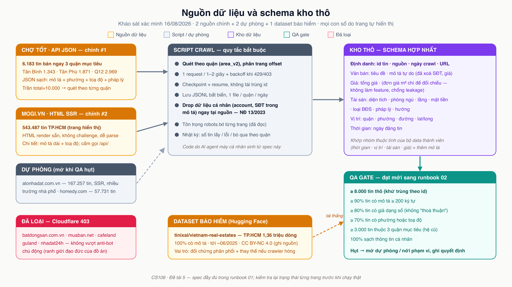
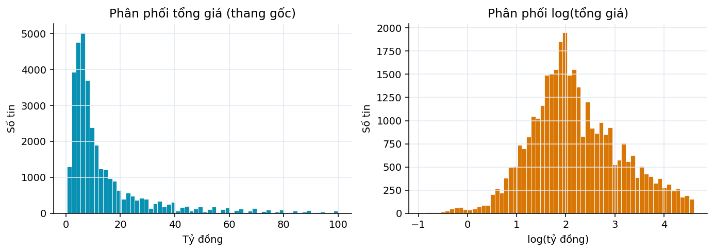
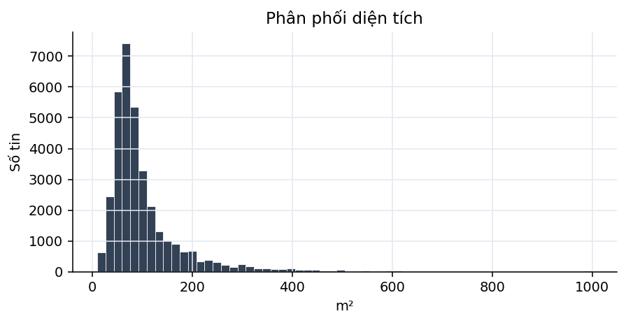
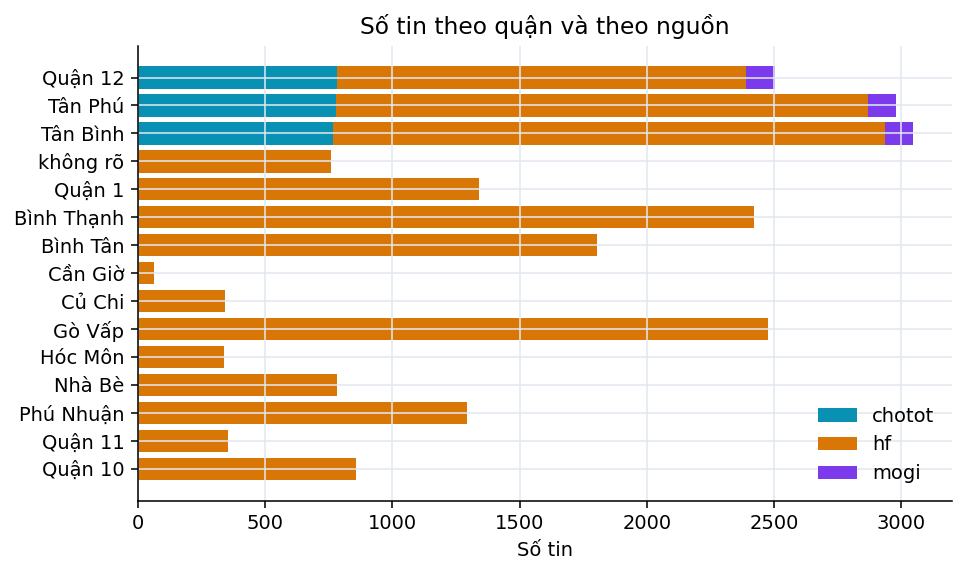

# Dữ liệu

## Nguồn thu thập

| Nguồn | Cách lấy | Thời điểm | Vai trò |
|---|---|---|---|
| Chợ Tốt | API JSON công khai của gateway, quét theo từng quận | 19/08/2026 | Nguồn chính, tin đang rao 2026 |
| mogi.vn | Parse HTML trang danh sách và trang chi tiết | 19/08/2026 | Nguồn thứ hai, giảm lệch theo một sàn |
| `tinixai/vietnam-real-estates` | Tải bộ dữ liệu công bố trên Hugging Face | 19/08/2026 | Nguồn lịch sử, tin rao 06/2025 – 03/2026 |

Lý do dùng hai nguồn crawl thay vì một: mỗi sàn có tệp người đăng và cách viết tin khác
nhau, học trên một sàn duy nhất thì mô hình bám theo thói quen của sàn đó. Bộ dữ liệu
Hugging Face đóng vai trò dữ liệu lịch sử để đo mức trôi giá theo thời gian, và là
phương án dự phòng nếu crawler hỏng.

Các trang bị loại khỏi phạm vi: batdongsan.com.vn, muaban.net, cafeland và guland đều
chặn bằng Cloudflare. Đồ án không vượt cơ chế chống bot chủ động, đây là ranh giới tự
đặt và được ghi lại ở mục đạo đức bên dưới.

Một đính chính so với khảo sát nguồn ban đầu: bộ dữ liệu Hugging Face **không** dừng ở
tháng 06/2025 như ghi nhận lúc lập kế hoạch, mà trải từ 06/2025 tới 03/2026. Nhóm kiểm
lại bằng cách lấy mẫu trường `published_at` ở nhiều vị trí khác nhau trong 3,5 triệu
dòng. Hệ quả là có lợi: ngoài lát cắt tới 06/2025 dùng làm tập huấn luyện cho thí nghiệm
chuyển giao, nhóm có thêm một chuỗi thời gian mười tháng liên tục để quan sát mặt bằng
giá thay đổi ra sao.

## Cách thu thập và ranh giới tự đặt

Cả hai crawler dùng chung một lớp phiên HTTP với ba ràng buộc cài cứng: tối đa một
request mỗi 1,5 giây, lùi luỹ tiến khi máy chủ trả 429 hoặc 403, và User-Agent khai báo
rõ đây là đồ án học thuật.

Với Chợ Tốt, nhóm phát hiện API danh sách đã trả về trường mô tả **đầy đủ**, xác nhận
bằng cách đối chiếu độ dài mô tả của cùng một tin giữa API danh sách và API chi tiết.
Vì vậy crawler không gọi trang chi tiết: một request lấy được 20 tin thay vì một, giảm
tải cho máy chủ bên kia khoảng hai mươi lần. Endpoint chi tiết còn kèm cả trường số điện
thoại, thêm một lý do để không đụng vào.

Kho dữ liệu thô là bất biến: mỗi quận mỗi ngày crawl một file JSONL, chỉ ghi thêm. Mỗi
tin được khử trùng theo mã tin do sàn cấp, và checkpoint cho phép chạy lại chỉ bổ sung
phần còn thiếu thay vì tải lại từ đầu.

## Bảo vệ thông tin cá nhân

Số điện thoại bị xoá **ngay tại thời điểm ghi file**, không phải ở bước tiền xử lý. Lý
do: file thô không bao giờ được sửa, nên một số điện thoại đã lọt vào đó sẽ nằm lại vĩnh
viễn.

Người rao thường né bộ lọc của sàn, nên số điện thoại xuất hiện dưới nhiều kiểu nguỵ
trang: chữ số Unicode ngoài ASCII, emoji keycap, chữ cái thay chữ số ("O9O1..."), số
viết bằng chữ ("không chín một"), ký tự vô hình chèn giữa các chữ số. Một chuỗi regex
đơn giản trên văn bản gốc không bắt xuể. Cách làm của nhóm: chuẩn hoá văn bản thành một
chuỗi chỉ-để-dò (mọi biến thể quy về chữ số ASCII) nhưng giữ bản đồ vị trí ngược về văn
bản gốc, dò trên bản chuẩn hoá rồi cắt đúng đoạn tương ứng trong bản gốc. Nhờ vậy phần
văn bản không phải số điện thoại giữ nguyên từng ký tự.

Mười bốn kiểu nguỵ trang được phủ bằng kiểm thử tự động. Cổng kiểm chất lượng quét lại
toàn bộ kho thô và xác nhận không còn tin nào mang dấu vết số điện thoại.

## Cổng kiểm chất lượng

Trước khi sang bước tiền xử lý, kho thô được chấm theo sáu ngưỡng. Mục đích không phải
chấm điểm dữ liệu mà là buộc phải ra quyết định: chưa đạt thì hoặc mở nguồn dự phòng,
hoặc nới phạm vi quận, và lựa chọn đó được ghi lại.

<!-- include: reports/tables/qa-gate.md -->

## Quy mô và quy trình làm sạch

<!-- include: reports/tables/data-funnel.md -->

Bảng trên đọc từ trên xuống là toàn bộ vòng đời của dữ liệu. Ba bước cắt nhiều nhất:

**Luật cứng miền hợp lệ và lọc tin cho thuê.** Bước lọc tin cho thuê từng gắn cờ 27% số
dòng khi quét cả phần mô tả, vì tin bán rất hay lấy dòng tiền cho thuê ra làm điểm bán
hàng ("nhà đang cho thuê 15 triệu/tháng, mua là có thu nhập ngay"). Những tin đó là tin
BÁN. Chuyển sang chỉ đọc tiêu đề, tỷ lệ gắn cờ về mức hợp lý.

**Khử trùng lặp.** Chạy trước khi chia tập, không phải sau: một căn nhà đăng lại mà rơi
vào cả tập huấn luyện lẫn tập kiểm tra thì mô hình được xem trước đáp án. Quy trình ba
tầng: chặn theo (phường, diện tích làm tròn 5 m²) → tương đồng TF-IDF trên n-gram ký tự
với ngưỡng cosine 0,85 → giá chênh không quá 3%. Dùng n-gram ký tự chứ không phải n-gram
từ vì bản đăng lại thường đổi vài từ, thêm emoji, viết hoa khác đi, nhưng kết cấu ký tự
gần như không đổi. Năm mươi cặp mẫu được xuất ra để rà tay.

**Ngoại lai hai tầng.** Tầng một là miền hợp lệ khai báo sẵn. Tầng hai là IQR trên
log(giá mỗi m²) tính **theo từng quận**: mức giá bình thường ở quận trung tâm là vô lý ở
ven đô, nên một ngưỡng chung cho cả thành phố sẽ cắt oan quận đắt và bỏ sót quận rẻ.
Quận có ít hơn 60 tin dùng ngưỡng toàn thành phố, vì IQR trên vài chục điểm còn nhiễu
hơn cái nó định lọc. Mọi ngưỡng tầng hai đều tính từ dữ liệu, không lấy từ con số nhớ
sẵn.

## Chuẩn hoá địa chỉ qua đợt sáp nhập 2025

Nghị quyết 202/2025/QH15 (Quốc hội, 12/06/2025) sắp xếp lại đơn vị hành chính cấp tỉnh,
cả nước còn 34 đơn vị gồm 28 tỉnh và 6 thành phố. Nghị quyết 1685/NQ-UBTVQH15 (Uỷ ban
Thường vụ Quốc hội, 16/06/2025) sắp xếp đơn vị hành chính cấp xã của TP.HCM: sau sắp
xếp thành phố có **168 đơn vị**, gồm 113 phường, 54 xã và 1 đặc khu. Mô hình chính quyền
hai cấp bắt đầu vận hành từ 01/07/2025, và đó là mốc đồ án dùng để phân định dữ liệu
trước và sau sáp nhập.

Dữ liệu của đồ án nằm ở cả hai hệ: tin crawl 2026 ghi theo phường mới, bộ lịch sử và
mogi ghi theo phường cũ. Không quy về một hệ thì cùng một khu phố bị tách thành nhiều
nhóm.

Nhóm chọn **hệ quy chiếu cũ** (quận + phường trước sáp nhập): phần lớn dữ liệu đã ở hệ
này, quận cũ là mức phân giải mà thị trường bất động sản quen dùng, và 168 đơn vị cấp xã mới
quá mịn cho vài chục nghìn tin.

Bảng ánh xạ phường mới sang phường cũ được dựng **từ chính dữ liệu crawl** thay vì tải
từ kho dữ liệu bên ngoài. API Chợ Tốt trả cả tên phường theo hệ cũ lẫn hệ mới cho cùng
một tin, nên mỗi tin là một cặp ánh xạ do chính sàn khẳng định. Cách này đúng với đúng
bộ dữ liệu đang dùng, có ngày chốt rõ ràng, và không kéo theo ràng buộc license của bên
thứ ba. Hạn chế phải nêu: bảng chỉ phủ các phường xuất hiện trong dữ liệu đã crawl.

Bảng dựng được cũng cho thấy đúng cạm bẫy đã lường trước: 14 trong 16 phường mới gộp từ
nhiều phường cũ khác nhau, tỷ lệ đa số thấp nhất chỉ 0,45. Với những phường đó, phép ánh
xạ chọn theo đa số và tỷ lệ đa số được lưu lại để biết ánh xạ nào đáng ngờ.

## Chất lượng trích xuất đặc trưng từ văn bản

<!-- include: reports/tables/extraction-quality.md -->

## Mô tả trường dữ liệu

Bảng đầy đủ nằm ở `docs/dataset-card.md`. Các trường chính:

| Nhóm | Trường | Ghi chú |
|---|---|---|
| Nhãn | `total_price_vnd` | Tổng giá rao, đơn vị VND |
| Kích thước | `area_m2`, `frontage_m`, `alley_width_m` | m², m |
| Bố cục | `bedrooms`, `bathrooms`, `floors` | |
| Vị trí | `district`, `ward`, `street`, `position` | Hệ quy chiếu cũ |
| Pháp lý | `legal_status`, `direction`, `property_type` | |
| Văn bản | `description`, `description_clean`, `description_tokens` | Bản gốc, bản đã xoá giá, bản đã tách từ |
| Chỉ báo | `*_missing`, `*_from_text` | Giá trị gốc thiếu / giá trị đến từ regex trên mô tả |

Hai nhóm cột chỉ báo là có chủ ý. `*_missing` giữ lại thông tin "người bán không ghi
trường này" — bản thân việc không ghi đã là một tín hiệu. `*_from_text` cho biết giá trị
đến từ form của sàn hay từ bộ luật đọc mô tả, để đo được phần đóng góp của bước trích
xuất.

## Thống kê mô tả

Phân phối giá lệch phải nặng với đuôi kéo dài. Đây chính là lập luận cho việc huấn luyện
trên log(giá): thang log gần đối xứng hơn hẳn, và sai số trên thang log là sai số tương
đối, nghĩa là lệch 10% ở căn hai tỷ bị phạt ngang lệch 10% ở căn hai mươi tỷ.

Phủ dữ liệu không đều: ba quận mục tiêu dày hơn hẳn phần còn lại. Kết quả cho các quận
khác vì thế kém tin cậy hơn, và thí nghiệm E3 đo trực tiếp mức suy giảm đó.

Chênh lệch giá mỗi m² giữa các quận là lý do ngưỡng ngoại lai được tính theo từng quận
chứ không tính chung cho cả thành phố.

## Đạo đức và giấy phép

Bốn ranh giới nhóm tự đặt và tuân thủ:

1. **Tôn trọng `robots.txt` từng trang.** Bản chụp nguyên văn kèm ngày giờ tải nằm trong
   `docs/robots-snapshots/`. Với mogi.vn, các nhánh bị cấm (`/api/`, `/Property/`,
   `/template/`, `/MarketPrice/`, `/trang-ca-nhan/`) đều không được crawler chạm tới.
2. **Không vượt anti-bot chủ động.** Các trang dựng Cloudflare bị loại khỏi danh sách
   nguồn ngay từ đầu chứ không tìm cách đi vòng. Đồ án học thuật không cần và không nên.
3. **Không thu thập, không lưu thông tin người bán.** Các trường tài khoản bị loại thẳng
   tại nguồn; số điện thoại trong mô tả bị xoá lúc ghi file. Căn cứ pháp lý hiện hành là
   Luật Bảo vệ dữ liệu cá nhân 2025 (hiệu lực 01/01/2026) cùng Nghị định 356/2025/NĐ-CP
   hướng dẫn thi hành. Tài liệu khảo sát ban đầu của nhóm dẫn Nghị định 13/2023/NĐ-CP;
   văn bản đó đã hết hiệu lực từ 01/01/2026, trước thời điểm crawl, nên phần tham khảo
   đã được sửa lại cho đúng.
4. **Không tái phân phối dữ liệu thô.** Thư mục `data/` bị chặn khỏi git. Repo chỉ chứa
   mã nguồn, bảng kết quả và tài liệu.

Giấy phép cần ghi nhận: bộ dữ liệu lịch sử `tinixai/vietnam-real-estates` phát hành theo
CC BY-NC 4.0, cho phép dùng phi thương mại và yêu cầu ghi nguồn, hai điều kiện mà đồ án
đều đáp ứng.
