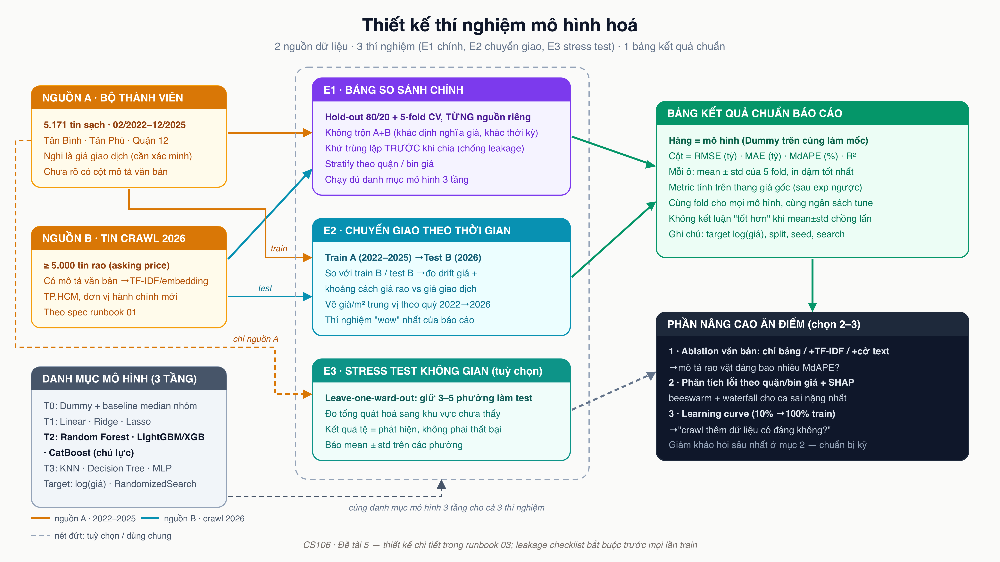
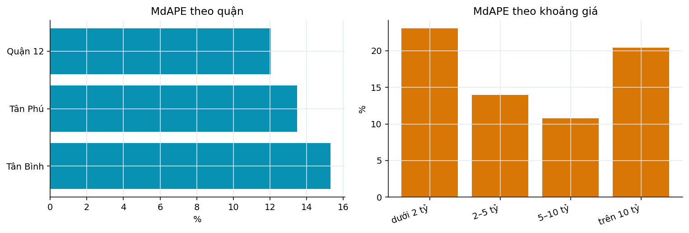
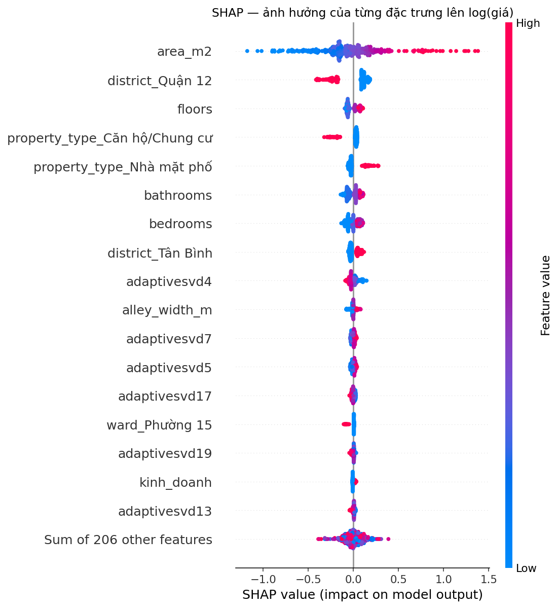
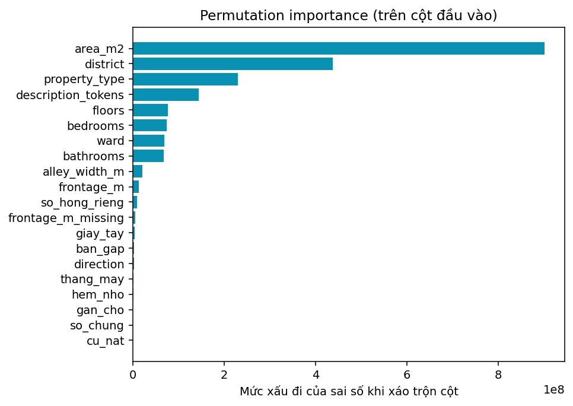
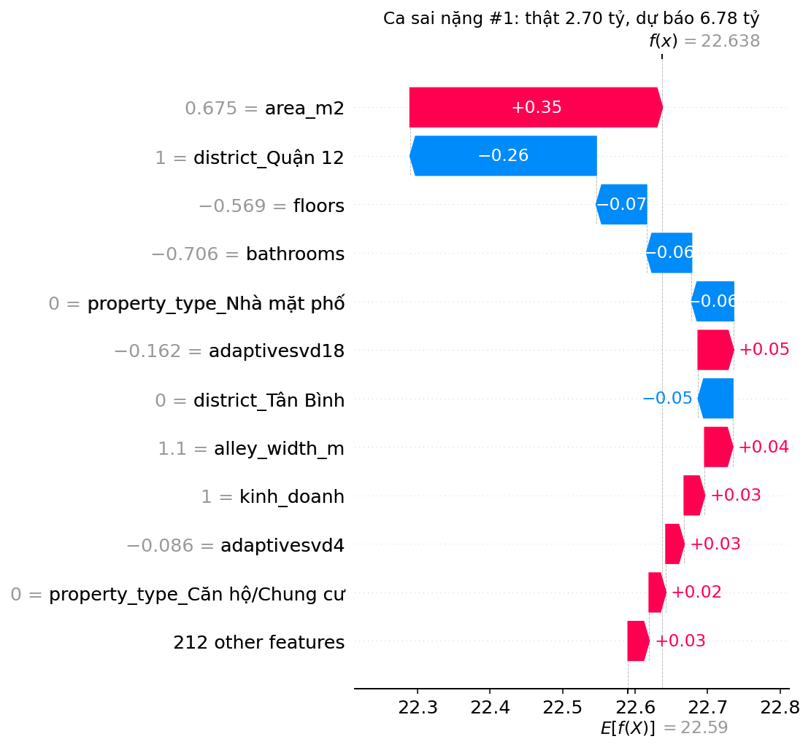
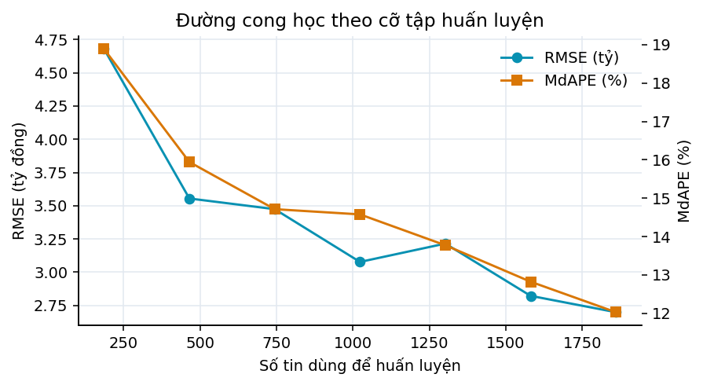

# Thí nghiệm và kết quả

## Thiết kế thí nghiệm

Ba thí nghiệm chạy trên cùng một danh mục mô hình và cùng quy tắc chia tập.

- **E1, bảng so sánh chính**: hold-out 80/20 cộng 5-fold cross-validation trên phần
  huấn luyện, chạy riêng cho từng nguồn dữ liệu. Chia tập có phân tầng theo quận và theo
  khoảng giá. Khử trùng lặp thực hiện trước khi chia.
- **E2, chuyển giao theo thời gian**: huấn luyện trên tin rao tới 06/2025, kiểm tra trên
  tin rao crawl tháng 08/2026. Chênh lệch so với E1 nguồn 2026 là thước đo mức trôi giá
  theo thời gian.
- **E3, stress test không gian**: giữ lần lượt các phường nhiều tin nhất làm tập kiểm
  tra, báo cáo trung bình và độ lệch chuẩn. Thí nghiệm này đo khả năng tổng quát hoá sang
  khu vực mô hình chưa thấy.

Hai nguồn dữ liệu không được trộn chung làm thí nghiệm chính vì chúng phủ thời kỳ và địa
bàn khác nhau, nên cờ nguồn sẽ lẫn với biến thời gian và với địa bàn.

Sau khi nguồn lịch sử chuyển sang bộ Hugging Face, cả hai phía của E2 đều là **giá rao**.
Thiết kế ban đầu định đo chênh lệch giữa giá giao dịch và giá rao lẫn với trôi giá theo
thời gian; thiết kế hiện tại chỉ đo một thứ, và vì thế dễ bảo vệ hơn.

## Điều kiện so sánh công bằng

Ba ràng buộc được cài vào code chứ không dựa vào kỷ luật của người chạy:

**Cùng một bộ fold cho mọi mô hình.** Phép chia được tính một lần rồi ghi ra đĩa kèm mã
băm của bộ mã tin. Nếu mỗi mô hình tự chia tập theo seed riêng thì chênh lệch giữa hai
dòng trong bảng một phần là chênh lệch giữa hai phép chia, không đọc được gì.

**Cùng ngân sách tinh chỉnh.** RandomizedSearch với số cấu hình như nhau cho mọi mô
hình, cùng seed. Cho mô hình này hai trăm cấu hình còn mô hình kia mười thì bảng so sánh
đo ngân sách chứ không đo mô hình.

**Danh sách kiểm rò rỉ chạy trước mỗi lần huấn luyện**, không phải một lần lúc đầu. Kết
quả được lưu cạnh mỗi file kết quả. Chi tiết ở chương Phương pháp.

## Chỉ số đánh giá

Mô hình huấn luyện trên log(tổng giá), mọi chỉ số tính **sau khi đã quy ngược về thang
VND**. RMSE và MAE báo bằng tỷ đồng. MdAPE là sai số phần trăm trung vị, bất biến theo
thang đo nên so được giữa quận đắt và quận rẻ. R² báo kèm ba chỉ số kia chứ không đứng
một mình.

## Bảng kết quả chính (E1)

<!-- include: reports/tables/e1-results-chotot.md -->

<!-- include: reports/tables/e1-results-hf.md -->

### Đọc bảng E1

**Mọi mô hình học máy đều thắng Dummy, nhưng mốc đáng quan tâm là baseline môi giới.**
Trung vị giá mỗi m² theo (quận, phường, loại nhà) nhân diện tích chính là cách một người
môi giới định giá trong đầu. Khoảng cách giữa mô hình tốt nhất và mốc đó mới là phần giá
trị mà học máy thực sự tạo ra; khoảng cách so với Dummy chỉ nói rằng dữ liệu có tín hiệu.

**Nhóm boosting dẫn đầu, và cách biệt giữa chúng nhỏ hơn độ lệch chuẩn giữa các fold.**
Khi hai khoảng trung bình ± độ lệch chuẩn chồng lấn gần hết thì không được tuyên bố mô
hình này tốt hơn mô hình kia; bảng chỉ cho phép nói cả nhóm boosting cùng ở mức tốt nhất.

**Nhóm tuyến tính có MdAPE khá nhưng RMSE và R² rất xấu, có khi âm.** Đây không phải lỗi
cài đặt mà là hệ quả trực tiếp của việc huấn luyện trên log giá: mô hình tuyến tính trên
không gian đặc trưng nhiều chiều thỉnh thoảng ngoại suy rất xa ở một vài điểm, và phép
`exp` biến sai lệch đó thành con số khổng lồ trên thang VND. Trung vị không bị ảnh hưởng
nên MdAPE vẫn đẹp, còn RMSE và R² thì sụp.

Đây chính là lý do đề tài yêu cầu báo cả ba chỉ số. Đọc R² một mình sẽ kết luận hồi quy
tuyến tính vô dụng; đọc MdAPE một mình sẽ kết luận nó ngang ngửa boosting. Cả hai kết
luận đều sai. Sự thật là hồi quy tuyến tính đúng ở phần lớn ca nhưng sai thảm ở một số ít
ca, còn boosting thì ổn định ở cả hai mặt.

### Không so R² giữa hai bảng E1

Hai bảng E1 nằm cạnh nhau nên rất dễ bị đọc chéo cột. Với MdAPE thì đọc chéo được, vì đó
là sai số phần trăm và không phụ thuộc phương sai của tập. Với **R² thì không**.

R² đo phần phương sai được giải thích, mà mẫu số của nó chính là phương sai của tập đang
xét. Bộ lịch sử phủ toàn thành phố với hơn hai mươi quận và biên độ giá rộng hơn hẳn bộ
crawl, vốn tập trung vào ba quận. Tập nào có phương sai lớn hơn thì cùng một mô hình sẽ
cho R² cao hơn, kể cả khi nó dự báo tệ hơn theo phần trăm. Trên dữ liệu của nhóm, hiện
tượng đó xảy ra đúng như vậy: cùng một mô hình cho R² cao hơn nhưng MdAPE lại tệ hơn trên
bộ lịch sử.

Vì thế mỗi bảng E1 chỉ được dùng để xếp hạng các mô hình **bên trong** nó. So sánh giữa
hai nguồn phải dựa vào MdAPE, và câu hỏi "chuyển giao giữa hai nguồn mất bao nhiêu" là
việc của thí nghiệm E2 chứ không phải của việc đặt hai bảng cạnh nhau.

## Ablation: đặc trưng văn bản đáng bao nhiêu?

<!-- include: reports/tables/ablation.md -->

Bốn cấu hình chạy trên cùng bộ fold, cùng mô hình, cùng ngân sách tinh chỉnh, khác biệt
duy nhất là nhánh văn bản. Đây là con số trả lời trực tiếp câu hỏi trung tâm của đề tài:
mô tả rao vặt mang bao nhiêu tín hiệu giá mà các trường có cấu trúc không có.

## Chuyển giao theo thời gian (E2)

<!-- include: reports/tables/e2-results.md -->

### Một cảnh báo phải đọc kèm hình trên

Đường trung vị của cả ba quận mục tiêu đi ngang trong suốt mười tháng dữ liệu lịch sử
(06/2025 – 03/2026), rồi **rơi xuống** ở điểm tin crawl tháng 08/2026. Cám dỗ là kết
luận ngay rằng mặt bằng giá rao đã giảm. Kết luận đó chưa đủ căn cứ, vì đoạn nét đứt
trên hình cùng lúc bắc qua hai thứ:

- **năm tháng không có dữ liệu** (04/2026 – 07/2026), và
- **một lần đổi nguồn**: phần bên trái là bộ lịch sử, điểm bên phải là dữ liệu nhóm tự
  crawl từ hai sàn khác.

Hai sàn khác nhau có tệp người đăng và cơ cấu sản phẩm khác nhau, nên một phần mức chênh
là chênh giữa nguồn chứ không phải chênh theo thời gian. Nhóm không tách được hai thành
phần này bằng dữ liệu hiện có, nên không quy toàn bộ mức rơi cho trôi giá. Đây cũng là
lý do hình được vẽ nét đứt và ký hiệu điểm khác nhau ở hai phía thay vì một đường liền:
người đọc phải thấy chỗ nối là chỗ đáng ngờ.

Cách kiểm chứng cho lần sau đã rõ: crawl bù các tháng còn thiếu trên chính hai sàn đang
dùng, khi đó cả đường sẽ nằm trên một nguồn duy nhất và mức trôi đọc được trực tiếp.

## Stress test không gian (E3)

<!-- include: reports/tables/e3-results.md -->

## Phân tích lỗi

Hai lát cắt được xem: theo quận và theo khoảng giá. Lát cắt theo quận cho biết mô hình
yếu ở địa bàn nào, thường là các quận ít tin. Lát cắt theo khoảng giá cho biết mô hình
xử lý phân khúc nào kém nhất; với dữ liệu lệch phải, phân khúc trên mười tỷ luôn là phần
khó nhất vì vừa ít mẫu vừa đa dạng.

## Giải thích mô hình

Biểu đồ beeswarm cho biết đặc trưng nào ảnh hưởng mạnh nhất tới dự báo trên toàn tập, và
ảnh hưởng theo chiều nào.

Permutation importance được báo kèm chứ không dùng riêng impurity importance của mô hình
cây. Impurity importance thiên vị các biến có nhiều mức — như tên đường và phường — nên
đọc một mình sẽ dẫn tới kết luận sai về biến nào thật sự quan trọng.

Ba biểu đồ waterfall cho ba ca sai nặng nhất được xem riêng. Chúng thường là bất động
sản dị biệt: diện tích rất lớn, vị trí đặc thù, hoặc tin ghi thiếu thông tin then chốt.

## Đường cong học

Đường cong này trả lời một câu hỏi thực tế: crawl thêm dữ liệu có đáng không. Đường còn
dốc ở mốc 100% nghĩa là thêm tin vẫn còn cải thiện đáng kể. Đường đã phẳng nghĩa là nút
thắt nằm ở đặc trưng và ở chất lượng nhãn chứ không ở số lượng tin, và công sức nên
chuyển sang chỗ khác.
