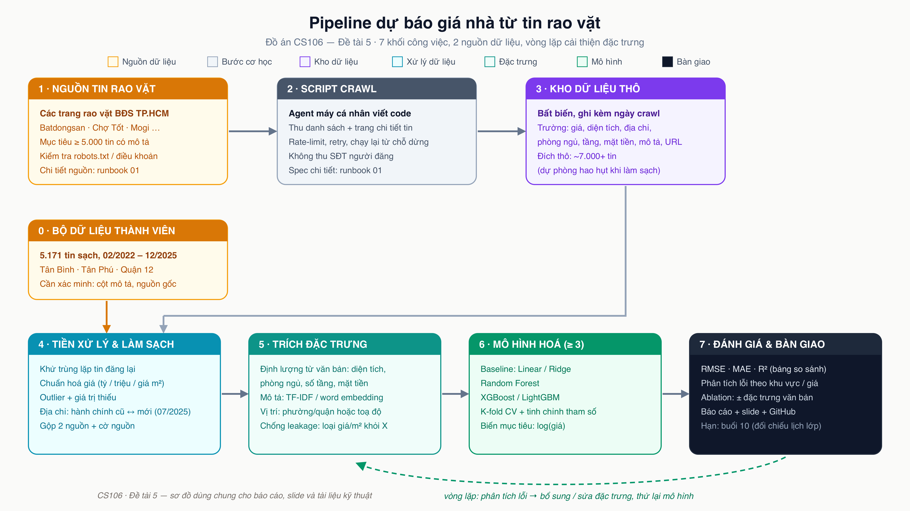
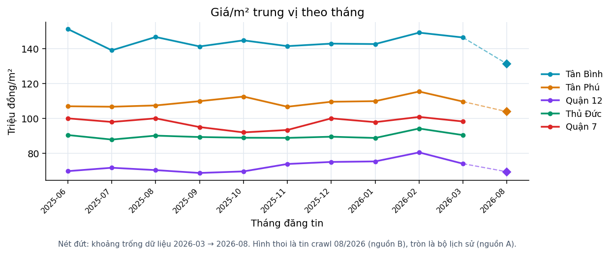

# Bài toán

Ước lượng **tổng giá rao** của một bất động sản tại TP.HCM từ:

- các thuộc tính có cấu trúc: diện tích, phòng ngủ, số tầng, vị trí, pháp lý
- và **mô tả tự do** của tin rao

Vì sao đáng làm: mô tả chứa thông tin mà form không có — "hẻm xe hơi", "nở hậu", "ngộp
bank", "sổ hồng riêng". Câu hỏi trung tâm: phần văn bản đó đáng bao nhiêu?

---

# Ba nguồn dữ liệu

| Vai trò | Nguồn | Cách lấy |
|---|---|---|
| Hiện tại | Chợ Tốt | API JSON công khai, quét theo quận |
| Hiện tại | mogi.vn | Parse HTML danh sách → chi tiết |
| Lịch sử | `tinixai/vietnam-real-estates` | Tải parquet từ Hugging Face |

Ranh giới tự đặt: tôn trọng `robots.txt`, không vượt anti-bot chủ động, 1 request mỗi
1,5 giây, không thu thập thông tin người bán.

---

# Xoá số điện thoại ngay lúc ghi file

Người rao né bộ lọc của sàn bằng đủ kiểu: chữ số Unicode, emoji, chữ cái thay số, số
viết bằng chữ, ký tự vô hình chèn giữa.

Cách xử lý: chuẩn hoá thành chuỗi *chỉ-để-dò* nhưng **giữ bản đồ vị trí ngược** về văn
bản gốc → chỉ đúng đoạn số điện thoại bị xoá.

14 kiểu nguỵ trang phủ bằng test · **0 số sót lại** trong kho thô.

---

# Trích đặc trưng định lượng từ văn bản

Bảy trường rút bằng regex. Ba luật khó nhất:

- **"1 trệt 2 lầu" = 3 tầng** — tiếng Việt đếm tầng bằng phép cộng thành phần
- **"4x15" là kích thước, không phải diện tích** — phải nhân ra, và chiều ngang chính là
  mặt tiền
- **"nhà mặt tiền" ≠ "mặt tiền 4m"** — một cái là loại vị trí, một cái là số đo

---

# Đo chất lượng bằng nhãn độc lập

Nhãn **không** do LLM gán, mà lấy từ chính **trường có cấu trúc người bán điền vào
form** — thứ bộ luật regex không hề nhìn thấy.

| Trường | F1 |
|---|---|
| Diện tích | **0,939** ✓ |
| Số phòng ngủ | 0,887 |
| Số nhà tắm | 0,894 |
| Số tầng | 0,802 |

Số tầng dừng dưới chỉ tiêu: 13/17 lỗi còn lại lệch **đúng 1 đơn vị**, trên các tin viết
"1 trệt 1 lầu" nhưng điền số 1 vào form. Nhiễu của nhãn, không phải bộ luật đọc sai.

---

# Sáp nhập hành chính 2025

TP.HCM còn **168 đơn vị cấp xã** (113 phường, 54 xã, 1 đặc khu) từ 01/07/2025.
Tin 2026 ghi phường mới, dữ liệu lịch sử ghi phường cũ.

**Bảng ánh xạ dựng từ chính dữ liệu**: API Chợ Tốt trả cả tên phường hệ cũ lẫn hệ mới
cho cùng một tin → mỗi tin là một cặp ánh xạ do sàn khẳng định.

Kết quả cũng lộ ra cạm bẫy: **14/16 phường mới gộp từ nhiều phường cũ**, tỷ lệ đa số
thấp nhất 0,45.

---

# Chống rò rỉ nhãn: kiểm, không tin

Danh sách kiểm chạy trước **mỗi** lần huấn luyện. Nó bắt được hai lỗi thật:

1. Bước tách từ **tái tạo** cụm tiền sau khi đã lọc — bỏ dấu phẩy thập phân biến "5,85"
   thành "585" nằm cạnh chữ "tỷ" còn sót
2. Đơn giá lọt qua dưới dạng "110 **triệum2**" — thứ nhân với diện tích ra thẳng nhãn

Kết quả: **0/34.607** dòng mang token tiền vào TF-IDF.

---

# Pipeline

---

# Danh mục 12 mô hình, 4 tầng

| Tầng | Mô hình |
|---|---|
| 0 — mốc | Dummy · **trung vị giá/m² theo nhóm** |
| 1 — tuyến tính | Linear · Ridge · Lasso |
| 2 — chủ lực | Random Forest · LightGBM · CatBoost · XGBoost |
| 3 — mở rộng | KNN · Cây quyết định · MLP |

Mốc đáng quan tâm nhất là **baseline môi giới** — cách một người môi giới định giá trong
đầu. Thắng Dummy chỉ chứng minh dữ liệu có tín hiệu.

---

# Kết quả chính (E1)

<!-- SLIDE: chèn bảng rút gọn từ reports/tables/e1-results-chotot.md, giữ 6 dòng
     Dummy · baseline nhóm · Ridge · Random Forest · LightGBM · CatBoost -->

Điều kiện so sánh công bằng: cùng bộ fold, cùng ngân sách tinh chỉnh, cùng seed. Không
tuyên bố hơn kém khi hai khoảng trung bình ± độ lệch chuẩn chồng lấn.

---

# Vì sao phải báo cả ba chỉ số

Nhóm tuyến tính: **MdAPE khá, nhưng R² âm**.

Không phải lỗi cài đặt. Huấn luyện trên log giá, mô hình tuyến tính ngoại suy rất xa ở
vài điểm, phép `exp` biến sai lệch đó thành con số khổng lồ trên thang VND. Trung vị
không bị ảnh hưởng, RMSE thì sụp.

- Đọc R² một mình → kết luận hồi quy tuyến tính vô dụng. Sai.
- Đọc MdAPE một mình → kết luận nó ngang boosting. Cũng sai.

---

# Ablation: văn bản đáng bao nhiêu?

<!-- SLIDE: chèn bảng từ reports/tables/ablation.md -->

Bốn cấu hình, cùng bộ fold, cùng mô hình, cùng ngân sách. Khác biệt duy nhất là nhánh
văn bản.

---

# E2 — trôi giá theo thời gian

Huấn luyện trên tin ≤ 06/2025 → kiểm trên tin crawl 08/2026.

Cả hai phía đều là **giá rao**, nên con số đo được là trôi giá theo thời gian thuần
tuý, không lẫn khoảng cách giá rao / giá giao dịch.

---

# Demo

Streamlit, nạp đúng artefact mà bước huấn luyện xuất ra. Khoảng tin cậy lấy từ MdAPE đo
trên hold-out, không phải con số tự đặt.

---

# Hạn chế — nói thẳng

- Học từ **giá rao**, không phải giá giao dịch. Nhóm không có dữ liệu để đo khoảng cách
  đó nên không phỏng đoán.
- Chỉ phủ TP.HCM, dày nhất ở ba quận mục tiêu. E3 đo trực tiếp mức suy giảm khi sang khu
  vực chưa thấy.
- Tin rao tự mâu thuẫn: form một đằng, mô tả một nẻo.
- Số tầng chưa đạt chỉ tiêu F1 0,9 — báo cáo trung thực kèm phân tích lỗi thay vì chỉnh
  luật cho khớp nhãn nhiễu.

---

# Hướng phát triển

- Bổ sung dữ liệu: crawl script đã resume được, chỉ cần chạy tiếp
- Toạ độ và đặc trưng khoảng cách (đã thiết kế, hoãn theo cut-line)
- Đối chiếu với dữ liệu giao dịch thật nếu tiếp cận được
- Đường cong học cho biết crawl thêm còn đáng hay không

---

# Phân công

| Thành viên | Phần phụ trách |
|---|---|
| _(cập nhật)_ | Thu thập dữ liệu |
| _(cập nhật)_ | Tiền xử lý và đặc trưng |
| _(cập nhật)_ | Mô hình và thí nghiệm |
| _(cập nhật)_ | Báo cáo và demo |
